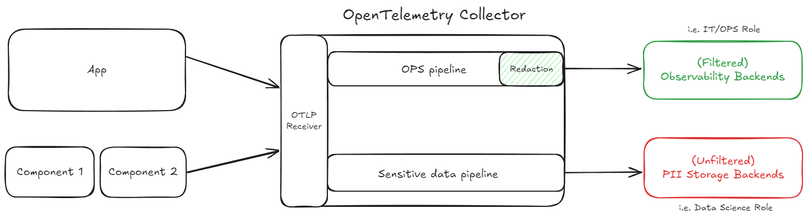
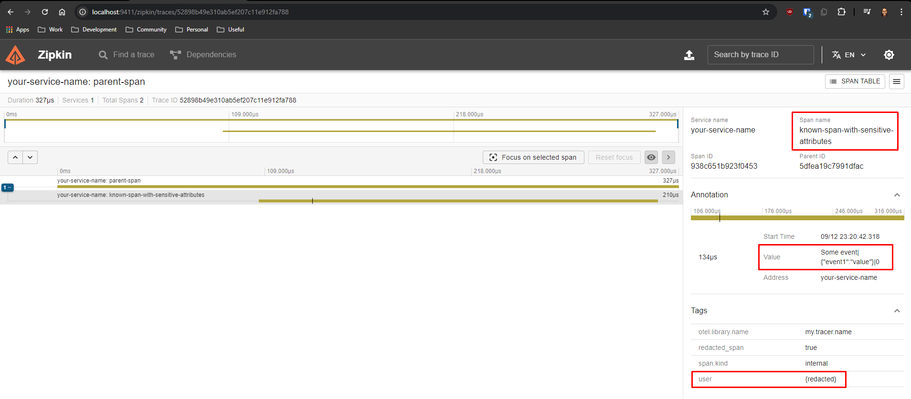
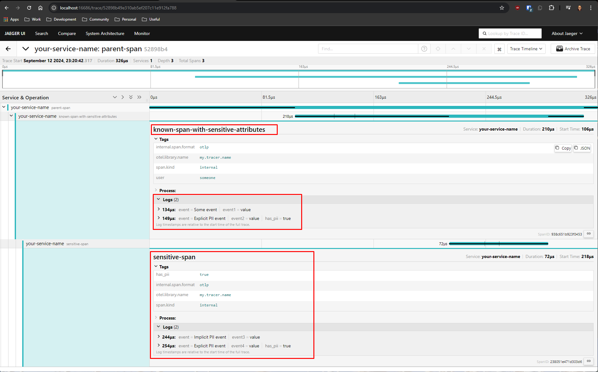

# OpenTelemetry Collector: Handling PII data example

## Design

## Filtered backend

- `known-span-with-sensitive-attributes` span's `user` attribute value is redacted.
- `Explicit PII event` with `"has_pii": "true"` is filtered out.
- `sensitive-span` with `"has_pii": "true"` span is filtered out.

## Unfiltered backend

- All spans and associated events (logs) are shown.
