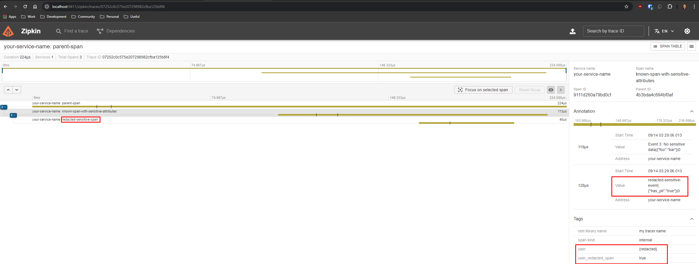

# OpenTelemetry Collector: Handling PII data example

## Design

## Filtered backend

- `known-span-with-sensitive-attributes` span's `user` attribute value is redacted.
- Names and attributes of spans or span events with `"has_pii": "true"` attribute is redacted.
- `known-sensitive-span` span attributes and events are redacted.
- Tax File Numbers are redacted from spans and span events.

## Unfiltered backend

- Tax File Numbers are redacted from spans and span events.
- All other spans and associated events (logs) are shown.
